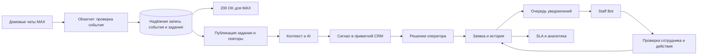

# План реализации единой цифровой диспетчерской УК

Документ предназначен для заказчика, технического руководителя и команды разработки. Он определяет порядок реализации ТЗ, зависимости, результаты этапов и условия выпуска первой production-версии.

**Основание:** [Техническое задание, версия 1.0](<Техническое задание — Единая цифровая диспетчерская управляющей компании.md>). Ссылки вида «ТЗ §12» обозначают разделы исходного документа.

**Дата подготовки:** 2026-09-13. **Статус:** предлагаемый план; оценки и проектные решения требуют уточнения на этапе Э0. Исходное ТЗ сохраняет приоритет.

## 1. Результат и исходное состояние

Целевой рабочий процесс: сообщение в MAX → контекстный анализ → сигнал → решение оператора → заявка → назначение → действия сотрудника в Staff Bot → контроль сроков → аналитика.

В каталоге проекта обнаружены только ТЗ и `AGENTS.md`. Исходного кода, Git-репозитория, зависимостей, схем БД, инфраструктурных конфигураций и тестов нет. План рассчитан на разработку с нуля. Доступность учётных записей MAX, LLM и серверов пока не проверена.

Предлагаемый порядок: сначала проверить интеграционные ограничения, затем создать защищённое ядро ручных заявок, параллельно наладить приём событий, после этого подключить Staff Bot и AI-сигналы. Каждая промежуточная поставка должна демонстрировать завершённый сценарий.

Ориентир для полного MVP — **18–20 календарных недель**: базовый график 16 недель и резерв 2–4 недели. Это предварительная инженерная оценка для команды из раздела 7, а не обязательство по сроку. Рабочая демонстрация ручной диспетчерской запланирована к концу недели 6, полного основного сценария с AI и MAX — к концу недели 10.

## 2. Границы первой версии

В MVP включаются следующие возможности:

| Область | Объём первой версии | Основание |
|---|---|---|
| MAX Observer | Два отдельных бота и токена; защищённый приём событий Observer; регистрация и привязка чатов; включение мониторинга; контроль доступности | ТЗ §3–4, §21, §44–46, §50 |
| AI | Контекст и цепочки ответов, предварительная фильтрация, IGNORE/WATCH/ESCALATE, объединение темы, приоритет, проверка результата, смена настроек поддерживаемого провайдера | ТЗ §5–10, §22–27 |
| Сигналы | Лента, описание и исходный контекст, наблюдение, откладывание, игнорирование, объединение сигналов, создание заявки, обратная связь | ТЗ §9–10, §30–32, §58, §67 |
| Заявки | Ручное создание и создание из сигнала, адрес, категория, приоритет, маршрутизация, назначение, статусы, история, комментарии, фотографии, поиск | ТЗ §11–14, §37–38 |
| Материалы | Запись потребности: наименование, количество, комментарий и ожидание материалов в заявке | ТЗ §15, §63 |
| Сотрудники | Привязка MAX ID, подтверждение доступа, рабочий статус, график, руководитель, дома, участки и категории; действия через Staff Bot | ТЗ §14, §18 |
| Управление | Иерархия организаций и объектов, системные и пользовательские роли, разрешения, справочники и настройки из §40 через админку | ТЗ §16–21, §40 |
| Контроль | Сроки реакции и выполнения, эскалация критического сигнала до заявки, эскалация непринятой/просроченной заявки, уведомления | ТЗ §8, §28–29 |
| Аналитика | Показатели оператора и руководителя, разбивки по домам, участкам и сотрудникам в пределах прав, базовые отчёты, метрики AI | ТЗ §30, §33–36, §57 |
| Эксплуатация | Аудит, ограничение доступа, безопасное хранение файлов и секретов, политика хранения данных, мониторинг, резервное копирование и проверка восстановления | ТЗ §41, §53–56 |

Во второй этап относятся прямой бот жителей и их профили, карта проблем, полноценный склад, отдельный процесс работы с подрядчиками, автоматические периодические отчёты, расширенная аналитика и обнаружение аномалий — ТЗ §39, §65–66. Статус ожидания подрядчика и настраиваемая роль подрядчика остаются доступны в MVP без отдельного модуля подрядчиков.

В первой версии раздел «Дома» реализуется списком и карточками; необходимость географической карты до пилота уточняется в Э0. В аналитике MVP хронические проблемы можно изучать по фильтрам и статистике; автоматическое выявление аномалий относится ко второму этапу. AI не отвечает жителям, не создаёт официальные заявки без уполномоченного человека и не закрывает их самостоятельно.

## 3. Решения до зависимых работ

Открытые вопросы не мешают подготовке проекта, но должны быть закрыты до указанных этапов. Таблица содержит предлагаемые рабочие допущения; она не подменяет решения заказчика.

| Решение | Рабочее предложение и что уточнить | Ответственный / срок |
|---|---|---|
| Масштаб | Пилот одной УК на одном участке и 3–5 чатах; модель организаций сохраняется. Уточнить число домов, сотрудников, сообщений в сутки, пиковый поток, размеры вложений и рост | Заказчик + техлид, Э0 |
| Доступ к MAX | Получить доступ к двум ботам, тестовому чату и сотрудникам, проверить разрешения, webhook, кнопки и фотографии. Реальные идентификаторы и токены передаются через защищённый канал | Заказчик + интегратор, Э0 |
| Вход в CRM | Выбрать существующий корпоративный вход либо отдельные учётные записи. Описать первичного владельца, восстановление доступа, отзыв сессий и защиту привилегированных пользователей. MAX ID сам по себе не подтверждает личность | Техлид + заказчик, до Э1 |
| Области доступа | Согласовать матрицу «действие × роль × организация/участок/дом/категория/назначение» и видимость внутренних комментариев; отдельно определить критические действия владельца | Заказчик + backend, до Э2 |
| Статусы | Утвердить начальный граф переходов, права переходов, обязательные комментарии/фото, различие выполнения, проверки и закрытия, отмену и возврат в работу. Новые статусы должны добавляться через админку | Оператор + мастер + backend, до Э2 |
| Приоритеты | Привести примеры `MEDIUM` и `Normal` в ТЗ к единому начальному справочнику; определить соответствие AI-оценки бизнес-приоритету | Заказчик, до Э2/Э5 |
| Адрес и районный чат | Одна тема может затрагивать несколько домов. Предлагается сигнал с несколькими объектами и отдельная заявка на каждый подтверждённый дом с общей связью источника; это уточняет схему §48 и требует решения до реализации | Оператор + техлид, до Э2/Э5 |
| Маршрутизация | Определить приоритет правил, дежурства, замещения и действие при отсутствии мастера/исполнителя. Предлагается оставлять заявку в видимой очереди оператора без скрытого автоматического назначения | Мастер + backend, до Э2 |
| SLA | Определить начало/окончание реакции и выполнения, рабочее время, часовой пояс, праздники, паузы ожидания материалов/доступа/подрядчика, переназначение и смену приоритета. Примеры минут в ТЗ не считать утверждёнными нормативами | Заказчик, до модели Э2; параметры до Э6 |
| Наблюдение | Определить срок жизни WATCH, срок откладывания, повторное открытие темы после отклонения/закрытия и правила объединения. WATCH виден в отдельном разделе без обычных уведомлений оператору | Оператор + AI-разработчик, до Э5 |
| AI и бюджет | Выбрать первого провайдера по качеству на примерах, задержке, условиям обработки данных и бюджету. В MVP один рабочий адаптер; смена модели/параметров через конфигурацию. Новый несовместимый API требует нового адаптера | Заказчик + техлид, Э0; проверка в Э5 |
| Данные и файлы | Утвердить сроки хранения контекста, источников подтверждённых заявок, аудита, вложений и резервных копий; допустимость передачи выбранных данных LLM; правила удаления и доступа | Ответственный за данные + заказчик, до работы с реальными сообщениями |
| AI-приёмка | Согласовать размеченную выборку, долю ложных сигналов и пропусков, правила критических ситуаций, допустимую стоимость и задержку. Процент confidence не считать доказанной точностью | Оператор + QA + AI-разработчик, план в Э0, пороги до Э5 |
| Отчёты | Уточнить формат базового экспорта при наличии `analytics.export`, требуемые фильтры, формулы показателей и границы между базовыми и расширенными отчётами | Руководитель УК, до Э7 |

Согласованные решения оформить короткими записями архитектурных решений (ADR) и матрицами правил. Все новые внутренние контракты и поля БД проектируются на их основе; примеры JSON и endpoints из ТЗ не являются готовой полной спецификацией API.

### Проверенные ограничения MAX

По официальной документации, проверенной 2026-09-13, базовый домен — `platform-api2.max.ru`, токен передаётся в `Authorization`, для production используется webhook. Подготовка окружения включает корректное доверенное хранилище сертификатов; отключение проверки TLS не допускается. [Обзор MAX API](https://dev.max.ru/docs-api).

Webhook работает через HTTPS на порту 443; следует настроить `secret` и проверять `X-Max-Bot-Api-Secret`. Успешный ответ `200` требуется в пределах 30 секунд. Документация описывает повторные попытки и автоматическую отписку после 8 часов без успешного ответа. Поэтому план включает мониторинг подписки и приёма событий. [Подписка на webhook](https://dev.max.ru/docs-api/methods/POST/subscriptions).

Полный список чатов нельзя строить на `GET /chats`: документация указывает на прекращение поддержки метода. Идентификаторы нужно сохранять из событий и обслуживать собственный реестр. [Получение списка чатов](https://dev.max.ru/docs-api/methods/GET/chats).

Чтение сообщений по `chat_id` через `GET /messages` требует административных прав бота. Доступность истории и необходимые права проверяются на тестовом чате; бесконечный архив и полное восстановление всех событий через историю не предполагаются. [Получение сообщений](https://dev.max.ru/docs-api/methods/GET/messages).

В §46 ТЗ `external_event_id` следует понимать как требование к дедупликации, а не как гарантированное одноимённое поле MAX. Ключ нужно определить отдельно для каждого используемого типа события по подтверждённым схемам и обезличенным примерам; проверить новые сообщения, правки, удаления и callback. [Типы событий Update](https://dev.max.ru/docs-api/objects/Update).

Это проверка документации, а не проведённый интеграционный тест. Перед реализацией интеграции нужно повторно сверить контракт и закрепить примеры в тестовых данных.

## 4. Предлагаемая архитектура

Основу составляет модульный backend с общей доменной логикой и отдельными процессами приёма событий и фоновой обработки. Разделение процессов, сетевого доступа и учётных данных защищает CRM от публичного Observer-компонента.

Стек backend берётся из ТЗ §42: Python 3.12+, FastAPI, PostgreSQL, Redis, SQLAlchemy async, Alembic, Pydantic, HTTP-клиент, Docker и Nginx. Конкретные совместимые версии фиксируются на Э1. Frontend — адаптивное web-приложение по §51; библиотеку интерфейса и сборщик выбрать в Э0 с учётом команды. Решения для Telegram/Aiogram и Telegram Mini App из примеров skills к MAX не переносятся.

Предлагаемое разделение ответственности:

| Компонент | Ответственность и граница |
|---|---|
| Observer ingress | Проверка webhook, лимиты входа, запись допустимого события; отдельная учётная запись с минимальным доступом к приёмному хранилищу. Нет доступа к заявкам, сотрудникам, аналитике и Staff-токену |
| Приватный backend | Авторизация, доменные правила, сигналы, заявки, справочники, админка, аудит. Web API и Staff Bot используют одинаковые проверки доступа |
| Staff Bot | Привязка сотрудника, разрешённые действия, диалог комментария/материалов/фото, уведомления. Доступ определяется по подтверждённому отправителю события |
| Workers | Анализ AI, доставка уведомлений, восстановление обработки, SLA и эскалации; отдельные права по назначению |
| PostgreSQL | Долговечные события, бизнес-сущности, история, аудит и задания, которые необходимо восстановить после сбоя |
| Redis | Очередь/координация и ограниченный временный контекст; подтверждённые события не зависят от сохранности Redis |
| Хранилище файлов | Приватные фотографии и вложения с проверкой доступа; выбрать реализацию в Э0, отдельно от публичных статических файлов |
| Web-интерфейс | Вход, дашборды, сигналы и контекст, заявки и история, справочники, сотрудники, настройки, аналитика и аудит |

Поток обработки изображён на схеме. После проверки webhook событие и намерение фоновой обработки сохраняются атомарно; только после этого возвращается успешный ответ. Worker обрабатывает событие независимо от HTTP-запроса:

Для закрытия окна между записью в БД и очередью предлагается transactional outbox: запись бизнес-изменения и задания в одной транзакции с последующей повторяемой публикацией. Входящие события хранятся в надёжном журнале приёма. Названия технических таблиц, формат задания и библиотека очереди выбираются в ADR; это дополнение к минимальному списку таблиц ТЗ §47.

Необходимые свойства реализации:

- Повтор webhook или задания не создаёт повторного сообщения, сигнала или заявки. Параллельное подтверждение сигнала двумя операторами имеет один согласованный результат. Для сигнала на несколько домов ограничение применяется к согласованной единице создания заявки.
- Ошибка БД до сохранения не подтверждается успешным HTTP-ответом. Сбой очереди после сохранения восстанавливается из журнала. Неуспешные задания имеют ограниченные повторы, видимый статус и управляемый повторный запуск.
- Обработка сообщений одной темы учитывает порядок и версию контекста. Запоздалый AI-ответ не перезаписывает более свежий результат или решение оператора.
- Текст чата считается недоверенными данными. AI не получает административных инструментов; его JSON проверяется по схеме и разрешённым значениям/объектам. Внешние идентификаторы не дают доступ к чужой организации.
- Сбой AI остаётся ошибкой обработки, не превращается в IGNORE. Оператор видит деградацию и доступный ручной разбор сохранённых событий. После восстановления возможен повтор анализа без дублей.
- Технические действия и разрешения реализованы в коде, а роли и их наборы прав настраиваются в админке. Добавление произвольного названия permission не создаёт новую возможность backend.
- Статус имеет настраиваемые переходы и устойчивое значение для процесса: активность, ожидание, выполнение, проверка, закрытие/отмена и поведение таймеров. Переименование не должно менять историю и расчёт SLA.
- Категории, приоритеты и правила архивируются с сохранением ссылок исторических заявок. Изменение правил не пересчитывает прошлые показатели без явного отдельного решения.
- Права проверяются при чтении, изменении, экспорте, скачивании вложений и перед отправкой уведомления. Деактивация сотрудника или изменение участка немедленно влияет на последующие действия.
- Заявка, история и аудит изменяются согласованно. Аудит хранит достаточное описание действия без токенов и лишних персональных данных; обычные пользователи не могут его редактировать.
- Для исходящих сообщений гарантируется отсутствие повторного бизнес-действия. Возможность полностью исключить дубли доставки при сетевой неопределённости отдельно проверяется по MAX API; обещание exactly-once для внешней отправки не закладывается.

## 5. Этапы и критерии готовности

Нумерация Э0–Э8 относится к этапам этого плана. Недели относительные, отсчитываются от старта команды и доступности необходимых вводных. Этапы содержат эпики; перед началом исполнения их нужно разбить на задачи до двух рабочих дней.

| Этап | Недели / зависимости | Основные работы | Проверяемый результат |
|---|---|---|---|
| **Э0. Уточнение и интеграционный прототип** | 1; старт | Решения раздела 3; матрица ролей и переходов; техническая проверка двух MAX-ботов; обезличенные примеры событий; выбор frontend, очереди, файлов и первого LLM; план AI-оценки | В тестовом окружении доказаны приём сообщения, callback и обмен фото; известны права/ограничения; есть договорённость о пилоте, перечень ADR и обновлённая оценка |
| **Э1. Основа проекта** | 2–3; после Э0 | Репозиторий, структура по §43, зависимости и lock-файлы, конфигурация без секретов, dev/staging, БД и миграции, автоматические проверки, вход в CRM, первичный владелец, каркас прав и аудита, каркас frontend, журналы и health checks | Новый разработчик запускает проект по инструкции; сборка и проверки проходят; миграции применяются в тестовой БД; неавторизованный доступ отклоняется; секреты не попадают в клиент/логи |
| **Э2. Ручная диспетчерская** | 4–6; после Э1 | Организации, районы, участки, дома/корпуса/подъезды; сотрудники, графики, должности, роли и области доступа; справочники; модель переходов; ручные заявки, маршрутизация, назначения, комментарии, история, поиск; экраны админки и оператора | Администратор заводит участок и сотрудника; оператор создаёт заявку, назначает и проводит разрешённые переходы; история полна; прямые API-запросы не раскрывают чужие данные; нет назначения на недоступного сотрудника |
| **Э3. Надёжный Observer** | 4–5; после Э1, параллельно Э2 | Изоляция Observer; защищённый webhook; реестр чатов и административная привязка; нормализация и дедупликация; журнал приёма, outbox, повторы; изменения/удаления сообщений; ограниченный контекст; мониторинг подписки | Повтор и параллельная доставка не дублируют событие; остановка worker/Redis не теряет подтверждённое событие; неизвестный/отключённый чат не запускает AI; Observer не имеет доступа к CRM; права и история проверены на тестовом чате |
| **Э4. Staff Bot и уведомления** | 7–9; после Э2 и основы Э3 | Подтверждённая привязка MAX ID; принятие/работа/выполнение; комментарии и фото; потребность в материалах; отказ/невозможность выполнения по согласованным переходам; отмена ввода; обработка старых кнопок; очередь уведомлений и статусы доставки | Исполнитель выполняет ручную заявку через MAX; комментарий и фото привязаны к правильной заявке; потребность видна мастеру; повтор кнопки безопасен; бывший исполнитель/отключённый сотрудник не может изменить заявку |
| **Э5. AI и работа с сигналами** | 6–10; после Э3, связывание заявок после Э2 | Контекст, reply chain, pre-filter, адаптер LLM, схема ответа и проверка значений; темы WATCH; сопоставление с темами/сигналами/открытыми заявками; приоритет и критический путь; лента и контекст; все действия оператора; feedback и метрики AI | Пять сценариев ТЗ §59–63 проходят сквозную проверку; связанная тема даёт один сигнал; новый дом не приписывается произвольно; заявка появляется после уполномоченного решения; ошибка LLM видима и повторяема; выполнены согласованные пороги качества |
| **Э6. Сроки и завершение админки** | 11–12; после Э2, Э4 и Э5 | Таймеры сигналов и заявок, календари и паузы, эскалационные цепочки, защита от повторной эскалации, обработка смены правил; завершение настроек §40: AI, контекст, провайдер, маршрутизация, шаблоны, SLA, приоритеты | Критический сигнал эскалируется ещё до заявки; непринятая/просроченная заявка попадает нужному ответственному; рестарт не сбрасывает сроки; новый статус/роль и смена настроек поддерживаемого LLM не требуют изменения кода |
| **Э7. Аналитика и готовность эксплуатации** | 13–14; после Э6; отдельные проверки идут с Э1 | Дашборды, фильтры и базовый экспорт; сверка формул; интеграционные и нагрузочные проверки; проверка прав; удаление по срокам хранения; резервное копирование и восстановление БД/файлов; инструкции инцидентов и отката; обучение | Показатели сходятся с контрольными данными; ограничения доступа действуют во всех каналах; нагрузочные цели подтверждены; восстановление отрепетировано; выполнены условия допуска к пилоту из раздела 8 |
| **Э8. Ограниченный пилот и выпуск** | 15–16; после Э7 | Подключение согласованных чатов и сотрудников; сначала сравнение AI с ручным разбором, затем работа оператора по сигналам; сбор обратной связи, настройка и исправления; протокол приёмки | Представители УК проходят свои сценарии; известны фактические задержки, расходы и ошибки AI; нет открытых блокирующих дефектов; есть ответственные за поддержку, протокол пилота и решение о расширении |

Обязательные проверки входят в каждый этап. Э7 собирает доказательства готовности всей системы, а не откладывает проверку прав, тесты или мониторинг до конца разработки.

Критические зависимости:

- Э0 → Э1 → Э2 → Э4 → Э6 → Э7 → Э8 — операционная цепочка.
- Э0 → Э1 → Э3 → Э5 → Э6 — получение и анализ сообщений.
- Правила статусов/областей доступа нужны до реализации заявок и Staff Bot; фактические payload MAX — до интеграционного кода; решение по данным — до подключения реальных чатов.
- Frontend работает по согласованным контрактам параллельно backend. Изменение контракта включает обновление тестовых примеров, интерфейса и документации.

Контрольные демонстрации: неделя 3 — вход и основа проекта; неделя 6 — ручная заявка с назначением и историей; неделя 10 — сообщение MAX превращается через сигнал в выполненную сотрудником заявку; неделя 12 — контроль сроков и конфигурация; неделя 16 — протокол пилота. Резерв недель 17–20 используется по выявленным рискам.

## 6. Начальный бэклог небольших задач

Этот список запускает Э0–Э1 и даёт образец декомпозиции следующих этапов. Оценки указаны в часах непосредственной работы одного исполнителя; ожидание доступов и решений в них не входит. Каждая задача включает проверку результата и краткую документацию.

| ID | Задача / результат | Зависимость | Исполнитель | Часы |
|---|---|---|---|---|
| P-01 | Зафиксировать объём пилота, нагрузку, владельцев решений и границы MVP | Нет | Техлид + заказчик | 4–8 |
| P-02 | Проверить Observer в тестовом чате, права и сообщение через webhook; сохранить обезличенный пример | Доступ MAX | Backend интеграций | 8–16 |
| P-03 | Проверить Staff Bot: старт сотрудника, callback, фото; описать ошибки и примеры | Доступ MAX | Backend интеграций | 8–16 |
| P-04 | Составить матрицу системных/пользовательских ролей и областей данных, включая негативные сценарии | P-01 | Backend ядра + заказчик | 8–12 |
| P-05 | Описать начальные переходы заявки, бизнес-события таймеров, закрытие и повторное открытие | P-01 | Backend ядра + оператор | 8–12 |
| P-06 | Зафиксировать ADR по входу, изоляции Observer, очереди, файлам и выбранному стеку | P-02–P-05 | Техлид | 8–12 |
| P-07 | Определить правила хранения данных, маршрут решения по LLM и критерии тестовой выборки | P-01 | Заказчик + QA + техлид | 8–12 |
| P-08 | Описать основные экраны и сценарии: оператор, мастер, исполнитель, администратор | P-04–P-05 | Frontend + оператор | 8–16 |
| P-09 | Создать структуру проекта, зависимости и конфигурационные примеры без секретов | P-06 | Backend ядра | 8–12 |
| P-10 | Подготовить dev/staging и повторяемое подключение к БД/очереди | P-06, P-09 | DevOps | 8–16 |
| P-11 | Добавить каркас миграций и тестовую БД, проверить применение на чистом окружении | P-09–P-10 | Backend ядра | 8–12 |
| P-12 | Настроить сборку, проверку стиля/типов и запуск начальных тестов в CI | P-09–P-11 | DevOps + QA | 8–12 |
| P-13 | Подготовить каркас frontend, навигацию, формы ошибок/загрузки/пустого результата | P-08–P-09 | Frontend | 8–16 |
| P-14 | Реализовать первый проверяемый сценарий входа и отказ неавторизованному запросу | P-06, P-11 | Backend ядра | 8–16 |
| P-15 | Добавить структурированные журналы, корреляцию событий и начальную проверку доступности | P-09–P-10 | Backend интеграций | 8–12 |
| P-16 | Проверить запуск по инструкции на чистом окружении и показать результат Э1 | P-10–P-15 | QA | 4–8 |

Эпики следующих этапов декомпозируются тем же способом. Например, «ручные заявки» делятся на модель/миграцию, контракт создания, проверку доступа, назначение, переходы, историю, список/фильтры и формы интерфейса. Большая задача, не укладывающаяся в 16 часов, разделяется до начала исполнения; сроки эпиков не считаются суммой только этого начального бэклога.

Карточка задачи должна содержать: цель, ссылку на раздел ТЗ, входные контракты, ограничения, зависимости, критерии приёмки, необходимые проверки и предполагаемый способ отката. Изменения поставляются небольшими PR с проверкой другим разработчиком.

## 7. Команда, сроки и ресурсные ограничения

Базовый график предполагает следующий состав:

| Роль | Загрузка | Основная зона |
|---|---|---|
| Backend ядра | Полная | Данные, доступ, CRM, Staff-действия, SLA, аналитика |
| Backend интеграций / AI | Полная | MAX, надёжный приём, workers, LLM, качество анализа, доставка уведомлений |
| Frontend | Полная | Web-интерфейс и админка; сценарии и проверка с пользователями |
| QA | Половина ставки с Э0; полная на Э7–Э8 | Сценарии, автоматизация, интеграционные проверки, пилот |
| DevOps | Около четверти ставки, больше при подготовке и выпуске | Окружения, CI, наблюдаемость, восстановление и выпуск |
| Техлид | Около четверти ставки сверх двух backend-позиций | ADR, ревью, зависимости и выпуск |
| Представители УК | Регулярные выделенные часы | Оператор, мастер, администратор и руководитель принимают свои сценарии |

Параллелизм: на неделях 4–5 один backend ведёт заявки, другой — Observer; на неделях 7–9 первый ведёт Staff-процесс, второй — AI. Frontend сначала завершает справочники и ручные заявки, затем ленту сигналов, настройки и аналитику. QA подключается к каждому готовому сценарию.

Резерв 2–4 недели покрывает уточнение интеграций, настройку AI на реальных примерах, сложность конфигурируемых правил и замечания пилота. Длительная недоступность MAX, неготовность данных или изменение объёма требуют отдельного перепланирования сверх резерва.

Для одного универсального разработчика при отдельной помощи QA/DevOps ориентир составляет **8–12 месяцев**, с высокой неопределённостью до Э0. Ускорение работы инструментами генерации кода не устраняет проверку интеграций, правил и пилот.

После Э0 пересчитать график по выбранным решениям, после Э2 — по фактической скорости поставки. Денежная смета требует ставок команды, объёма хранения и измеренной стоимости LLM; тарифы провайдера и инфраструктуры этим планом не зафиксированы.

## 8. Проверки и приёмка

Сценарии из ТЗ §67 преобразуются в проверяемую матрицу. Тестовые данные должны включать минимум две организации/области доступа, несколько домов и сотрудников с разными правами; это позволяет выявить утечки, которые не видны в однопользовательской демонстрации.

| Проверка | Ожидаемый результат | Этап |
|---|---|---|
| Повтор и параллельная доставка одного webhook | Одна нормализованная запись; повтор не запускает повторное бизнес-действие | Э3 |
| Сбой после сохранения, перед публикацией; падение worker в середине обработки | Событие восстанавливается; потерянных подтверждённых событий и повторных результатов нет | Э3, Э5 |
| Неверный secret, неизвестный чат, выключенный мониторинг | Запрос отклонён либо безопасно учтён по контракту; не запускает неразрешённую обработку | Э3 |
| Бытовой шум и постепенное подтверждение проблемы | IGNORE не создаёт сигнал; WATCH сохраняет тему; дополнительные сообщения приводят к одному ESCALATE | Э5, ТЗ §60–61 |
| Критическое сообщение | Сигнал поступает в приоритетный путь без ожидания дополнительных подтверждений; создаётся таймер реакции оператора | Э5–Э6, ТЗ §62 |
| Невалидный JSON, чужой дом в ответе, timeout, превышение лимита LLM | Нет произвольной записи в БД; ошибка видна, событие сохранено, повтор контролируется | Э5 |
| Инструкция в тексте чата, пытающаяся изменить поведение системы | Не даёт AI доступа к действиям CRM, секретам или чужим объектам | Э5 |
| Два оператора одновременно подтверждают сигнал | Нет повторной заявки для одной согласованной единицы подтверждения; UI показывает действительный результат | Э5 |
| Откладывание, наблюдение, игнорирование, ручное объединение | Источники и история сохраняются; feedback учтён; возврат в работу следует согласованным правилам | Э5 |
| Чужая заявка по URL/API, вложение, экспорт, внутренний комментарий | Доступ запрещён во всех каналах, включая Staff Bot и уведомления | Э2–Э7 |
| Старая кнопка после переназначения/отключения сотрудника; повтор callback | Права и текущий статус проверяются заново, действие не повторяется | Э4 |
| Материалы и фото | Потребность и вложение прикреплены к нужной заявке, видны разрешённым ролям; некорректный/слишком большой файл отклоняется | Э4, ТЗ §63 |
| Настраиваемая роль, новый статус, изменение справочника | Настройка работает без изменения кода, не ломает существующие права, историю и таймеры | Э2, Э6 |
| Нет подходящего исполнителя, конфликт маршрутов, нерабочее время | Видимое исключение у оператора, применение согласованного правила, отсутствие потерянной заявки | Э2, Э6 |
| Пауза, смена приоритета, переназначение, рестарт планировщика | Расчёт срока воспроизводим, история решения сохранена, эскалация не дублируется | Э6 |
| Аналитика на контрольном наборе | Счётчики, время реакции/выполнения и просрочки совпадают с ожидаемыми; фильтры и права не обходятся | Э7 |
| Истечение хранения и восстановление резервной копии | Удаляются только предусмотренные политикой данные; сохраняются нужные связи; восстановленная среда пригодна для работы | Э7 |

Для AI подготовить обезличенную размеченную выборку из нескольких чатов: шум, сарказм, короткие ответы, разные адреса, дубли, аварии и развитие темы во времени. Отделить примеры настройки от контрольной выборки. Версионировать модель, промпт, параметры и набор оценки. Долю подтверждённых сигналов считать отдельно от полноты обнаружения: пропуски оцениваются ручным просмотром выборки исходных событий, включая IGNORE и WATCH.

Предлагаемые технические цели нужно утвердить в Э0 на согласованной нагрузке; они отсутствуют в ТЗ как численные обязательства:

| Показатель | Начальное предложение | Как проверять |
|---|---|---|
| Приём webhook | p95 до 1 секунды без ожидания LLM | Нагрузочный прогон и подтверждение долговечной записи |
| Обычное чтение/изменение CRM | p95 до 500 мс на согласованном объёме данных, без внешних вызовов | Измерение API и отдельно пользовательского интерфейса |
| Событие → видимый сигнал | p95 до 30 секунд при штатной работе; критические события имеют приоритет очереди | Сквозная временная метрика на контрольном потоке |
| Надёжность | Ноль потерянных подтверждённых событий и повторных заявок в проверках сбоев | Контроль количества и уникальности результатов |
| Качество AI | Численные пороги устанавливаются заказчиком после базовой оценки; все согласованные критические контрольные случаи должны быть обнаружены | Отложенная выборка, отдельный отчёт по критическим случаям |
| Восстановление | Допустимую потерю данных (RPO) и время восстановления (RTO) согласовать в Э0 | Практическое восстановление БД и вложений с измерением времени |

Прохождение контрольных критических случаев не означает гарантии обнаружения всех реальных аварий. В пилоте сохраняется действующий процесс диспетчеризации и разбор пропусков; это проверка качества внедрения, предусмотренная планом AI-приёмки.

Для допуска к пилоту Э7 должен завершить стендовые сценарии, проверки сборки/прав/сбоев/нагрузки, восстановление и подготовку инструкций. На тестовых данных должны быть достигнуты согласованные пороги AI. Назначаются участники пилота и поддержка, фиксируются его сборка и способ отката. Результаты реального пилота не являются условием его начала.

Окончательные условия выпуска, включая результаты Э8:

1. Пройти применимые критерии ТЗ §67 и пять примеров §59–63 на стенде, затем с участниками пилота.
2. Подтвердить сборку, типизацию, тесты бизнес-правил, интеграционные проверки с PostgreSQL/очередью, сквозные web/MAX-сценарии и контрактные тесты внешних ошибок. Точные команды закрепить после появления выбранного стека; в этом документе нет утверждения, что такие тесты уже существуют.
3. Проверить ограничения ролей и областей данных, изоляцию Observer, отсутствие секретов в клиенте/логах, безопасность файлов и политики удаления.
4. Продемонстрировать восстановление из резервной копии, повтор обработки зависших событий и сохранность аудита.
5. Подготовить инструкции оператора/мастера/администратора, наблюдение за очередями и подпиской MAX, порядок реакции на сбой AI/MAX и ответственных за поддержку.
6. Зафиксировать сборку выпуска, миграции, резервную копию и проверенный план отката. Предпочесть совместимые изменения схемы; откат приложения не должен требовать опасного удаления данных.
7. Получить решение заказчика по результатам пилота и плану расширения. Production-миграции выполнять только после отдельного подтверждения точной операции согласно `AGENTS.md`.

При сбое пилота отключить AI-мониторинг выбранных чатов настройкой, сохранить подтверждённые события и продолжить согласованный ручной процесс. Повторное подключение выполняется после разбора очередей, прав и причин сбоя.

## 9. Основные риски и действия

Риски привязаны к требованиям проекта и учитываются в графике:

| Риск | Влияние | Предусмотренное действие |
|---|---|---|
| Нет нужных прав MAX или меняется API | Не работает основной источник/канал работы сотрудников | Технический прототип в Э0, проверенные контракты, изолированный адаптер, мониторинг подписки |
| Не определены статусы, SLA и области доступа | Переделка модели данных, бот-кнопок и аналитики | Матрицы до Э2, конфигурируемые переходы, версионирование значимых правил |
| Неоднозначный дом или несколько домов в районном чате | Ошибочная маршрутизация и объединение | Решение по модели в Э0, ручное уточнение адреса, сохранение происхождения сигнала |
| Пропуск критического сообщения или слишком много ложных сигналов | Потеря доверия и перегрузка оператора | Контрольная выборка, отдельная оценка критических случаев, приоритет обработки, измерение пропусков, пилот с ручным сравнением |
| Разрыв между БД, очередью и отправкой в MAX | Потеря события или повторное действие | Журнал приёма, outbox, идемпотентные обработчики, испытания сбоев; явная обработка неопределённой доставки |
| Избыточное хранение или передача данных LLM | Невозможность согласовать production-обработку | Решение ответственного за данные до реальных чатов, минимизация контекста и управляемое удаление |
| Сложность админки недооценена | Сдвиг срока при формально работающем основном сценарии | Настройки поставляются вместе с модулями; отдельная сверка всего перечня §40 в Э6 |
| Сотрудник остановил бота или уведомление не дошло | Заявка остаётся непринятой | Видимый статус доставки, повторы по контракту, таймер принятия и эскалация; отправка не считается принятием |
| Растут поток сообщений и стоимость AI | Задержка обработки и перерасход | Ограниченный контекст, pre-filter, бюджет обработки, метрики токенов/очередей и нагрузочная проверка |
| Недостаточно времени заказчика или команды | Решения и приёмка блокируют этапы | Назначить владельцев решений, еженедельные демонстрации, пересчёт оценки после Э0 и Э2 |

## 10. Соответствие плану и передача в разработку

Матрица позволяет проверить, что план охватывает исходное ТЗ:

| Разделы ТЗ | Где реализуются |
|---|---|
| §1–4 — концепция, разделение контуров, два бота | Э0, Э1, Э3, Э4; архитектура раздела 4 |
| §5–10 — анализ, решения, критические события, сигналы | Э5, Э6 |
| §11–15 — заявки, статусы, комментарии, исполнитель, материалы | Э2, Э4 |
| §16–21 — роли, сотрудники, разрешения, иерархия, чаты | Э1–Э4, завершение Э6 |
| §22–27 — контекст, pipeline, провайдер, JSON, приоритет | Э3, Э5 |
| §28–29 — SLA и эскалации | Модель в Э2, таймеры и правила в Э6 |
| §30–32 — оператор, лента, контекст | Э2, Э5 |
| §33–36 — аналитика | Э7; автоматические аномалии после MVP |
| §37–38 — поиск и ручная заявка | Э2 |
| §39 — бот жителей | Второй этап |
| §40–41 — админка и аудит | Э1–Э6, проверка полноты Э7 |
| §42–49 — стек, структура, очередь, идемпотентность, данные, API | Э0–Э6 |
| §50–52 — MAX, frontend, экраны | Э0–Э7; карта и расширенные отчёты по границам раздела 2 |
| §53–56 — защита, данные, эксплуатация | Решения Э0, реализация Э1–Э7, проверка пилота Э8 |
| §57–58 — метрики и обратная связь AI | Э5, отчёты Э7, измерения Э8 |
| §59–63 — пять сквозных примеров | Э4–Э6, приёмка Э7–Э8 |
| §64–66 — состав MVP и следующий этап | Границы раздела 2 и этапы Э0–Э8 |
| §67–70 — приёмка и продуктовый результат | Матрица раздела 8, пилот Э8 |

Следующее действие при старте разработки — выполнить Э0 и задачи P-01–P-08, закрыть зависимые решения, затем поставлять основу проекта небольшими изменениями. Подготовка этого плана не запускает разработку, подключение реальных чатов или production-операции.

## 11. Использованные руководства и границы проверки

При подготовке обновлены `/root/claw-tools` и `/root/skills`; `/root/anthropic-skills` клонирован. Изучены исходное ТЗ, локальный `AGENTS.md` и структура каталога.

Применены следующие материалы:

- **Bambale0/claw:** `dev_agents_pack/prompts/issue-template-agent-task.md` и `pr-review-checklist.md` — небольшие задачи с контекстом, ограничениями, критериями приёмки и проверками.
- **wondelai/skills:** `technical-documentation/SKILL.md` и рекомендации по структуре документа — ориентация на читателя, разграничение проверенных требований и открытых решений, проверяемые результаты этапов.
- **anthropics/skills:** `skills/doc-coauthoring/SKILL.md` — сбор контекста, структура и независимая проверка читаемости/полноты плана.
- **Локальный team-lead:** `/root/.agents/skills/team-lead/SKILL.md` — зависимости, ADR, небольшие задачи и условия поставки. Шаблонный Telegram-стек и численные метрики из skill не приняты как требования проекта.

Проверка документации MAX подтверждает только опубликованный контракт на дату подготовки. Код приложения, инфраструктура, реальные боты, нагрузка и качество LLM в рамках планирования не тестировались. Эти проверки входят в будущие этапы и не отмечены выполненными.
